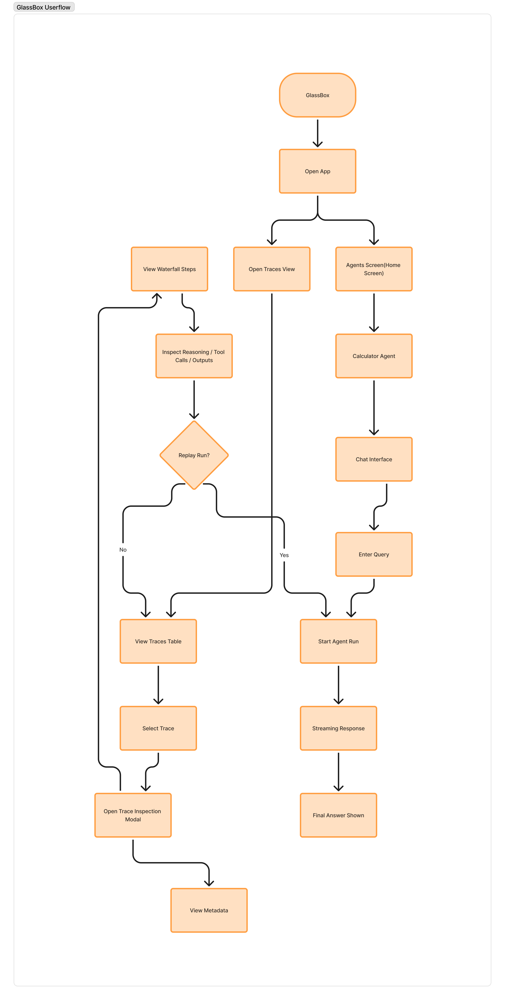

# GlassBox Agent Frontend

A modern, production-ready React application for the GlassBox Agent system. This frontend provides a premium, dark-themed interface for interacting with the Calculator Agent, inspecting execution traces, and managing sessions.

## 🚀 Features

### 💬 Streaming Chat Interface
- **Real-time Streaming**: Server-Sent Events (SSE) integration for live token streaming.
- **Thinking Process UI**: Visualizes the agent's reasoning steps (tool calls) in real-time.
- **Session Management**: Resume past conversations by Session ID.
- **Markdown Support**: Renders rich text responses.

### 🔍 Trace Inspection
- **Detailed Trace History**: View all agent execution runs.
- **Step-by-Step Breakdown**: Inspect inputs, outputs, latency, and costs for each step.
- **Replay Capability**: Re-run past traces to verify behavior or debug issues.
- **Version History**: Track changes and iterations of trace executions.

### UserFlow/.



### 🎨 UI/UX
- **Dark Mode First**: Sleek, high-contrast dark theme designed for developer ergonomics.
- **Responsive Design**: Fully responsive layout with collapsible sidebar.
- **Custom Components**: Reusable UI library (Alerts, Modals, Toasts) built with Tailwind CSS.
- **Toast Notifications**: Global notification system for user feedback.

## 🛠️ Tech Stack

- **Framework**: [React 18](https://reactjs.org/)
- **Build Tool**: [Vite](https://vitejs.dev/)
- **Styling**: [Tailwind CSS](https://tailwindcss.com/)
- **Icons**: [Lucide React](https://lucide.dev/)
- **HTTP Client**: [Axios](https://axios-http.com/)
- **State Management**: React Context & Hooks

## 📂 Project Structure

```
src/
├── components/         # Shared UI components
│   └── ui/             # Atomic design elements (Button, Card, Modal, etc.)
├── context/            # Global state (AuthContext)
├── features/           # Feature-based modules
│   ├── auth/           # Authentication logic
│   ├── chat/           # Chat interface and streaming logic
│   └── traces/         # Trace inspection and table views
├── hooks/              # Custom React hooks
├── layouts/            # Page layouts
├── pages/              # Route components
├── services/           # API integration
│   └── api/            # API client and endpoints
└── utils/              # Helper functions
```

## 🚦 Getting Started

### Prerequisites
- Node.js (v18 or higher)
- npm or yarn

### Installation

1.  **Install dependencies:**
    ```bash
    npm install
    ```

2.  **Configure Environment:**
    Create a `.env` file in the root directory (or use `.env.development`):
    ```env
    VITE_API_URL=http://localhost:8000/api/v1
    ```

3.  **Run Development Server:**
    ```bash
    npm run dev
    ```
    The app will be available at `http://localhost:5173`.

### Building for Production

```bash
npm run build
```
The build artifacts will be stored in the `dist/` directory.

## 🧪 Development

- **Linting**: `npm run lint`
- **Preview Build**: `npm run preview`

## 🔐 Authentication

The application currently supports **Guest Authentication**. A unique Guest ID is generated and stored in `localStorage` to persist sessions across reloads.

## 🤝 Contributing

1.  Follow the feature-based directory structure.
2.  Ensure all new components are responsive and support the dark theme.
3.  Use the shared UI components from `@/components/ui` whenever possible.